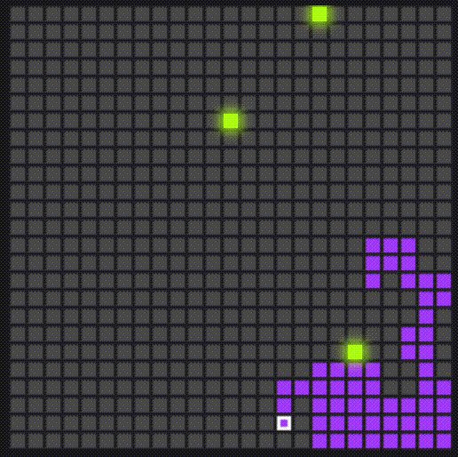
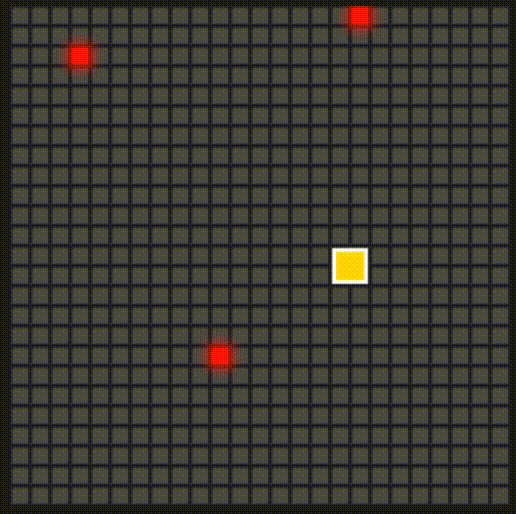
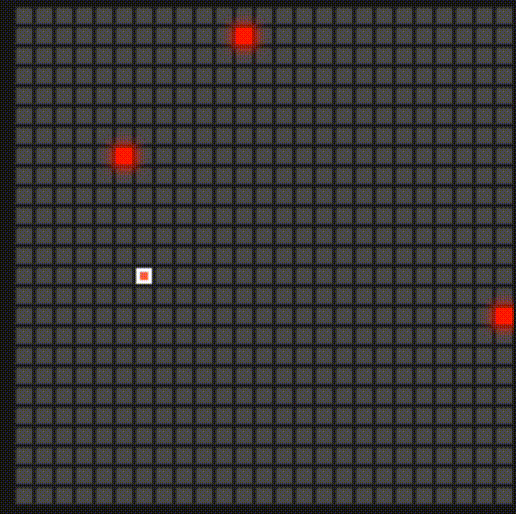
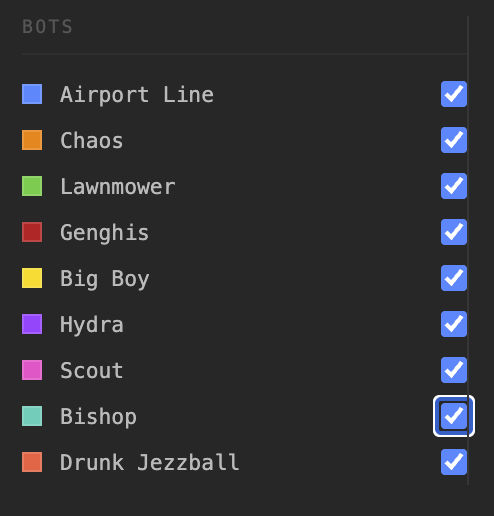
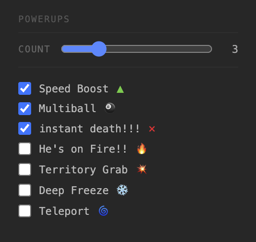

# Jason's Game Of Life (aka Land Grab Simulator)

## Overview

</img>


A simple game based on the [swapjs](https://swapjs.dev/) [Territory War demo](https://www.youtube.com/shorts/y1LwL70su3M), mixed with [Conway's Game Of Life](https://en.wikipedia.org/wiki/Conway%27s_Game_of_Life). 

Try a demo of *Jason's Game Of Life* [here](https://www.onejasonforsale.com/landgrab/).

## Hosting The Game Yourself

The game is a simple set of javascript files, a couple of html files, and a css file. Simply download the project and start a HTTP web server in the *src* folder of the project. 

If you're not familiar with web servers, a very easy to use web server comes with any python installation. Instructions for installing python on various operating systems is [here](https://realpython.com/installing-python/). Then, run python's webserver in the *src* directory on your computer like this: 

```
python -m http.server 8070
```

Then, open your browser to [http://localhost:8070](http://localhost:8070).

## How To Play

The game plays itself, similar to games such as [Totally Accurate Battle Simulator](https://en.wikipedia.org/wiki/Totally_Accurate_Battle_Simulator) and [SimLife](https://en.wikipedia.org/wiki/SimLife). You specify the game's scenario, and watch it play out. 

### The Bots

My personal favorite bot is *Hydra*, a bot that doesn't react well to *instant death* powerups:

</img>

*Big Boy* is also a beloved underdog. He's a bit on the slower side, but he's no slouch:

</img>

And who can forget *Drunk Jezzball*, the tipsy bot who means well but often loses the plot:

</img>

Try your hand at other bots when you play the game.

</img>

### Powerups

The game features several powerups that'll enhance the chaos:

</img>

### Game Modes

There are three game modes: 

 * *boring mode* is a simple single-game land grab simulation
 * *tournament mode* is a multi-round competition between the bots that you configure
 * *battle royale mode* has the bots playing in a battle to the death - last man standing wins. 

# History

This project was [vibe coded](https://en.wikipedia.org/wiki/Vibe_coding) in May of 2026 using [Claude Code](https://claude.com/) as an experiment to test Claude's ability to create and update a small project from scratch. 

All code was 100% written by Claude during a conversational coding session, with a few very minor changes made by hand (mainly filling in the about file and changing bot tick speed configuration). 

The ai model used was [Sonnet 4.6](https://www.anthropic.com/news/claude-sonnet-4-6). 

Complete vibe coding session logs are here:

 * [2026-05-11 terminal log.txt](misc/2026-05-11%20terminal%20log.txt)
 * [2026-05-11 terminal log 2.txt](misc/2026-05-11%20terminal%20log%202.txt)

Further experimentation that could have happened, but didn't:

 * Have Claude add thorough comments into the code
 * Generate unit tests and other such test harnesses with Claude
 * Observe if Claude can refactor the code's modularity
 * Can Claude clean up commit history (ie squashing commits) reliably?
 * Ask Claude to create a few new bots and game modes of its choosing

# Disclaimers

### Messy Code

The vibe coding session for this game was purposely sloppy and adhoc. As such, the unmodified code that Claude put together is less than ideal, but it works. 

### Specifications Are Not To Be Trusted

Occasionally, as an afterthought, Claude was directed to make attempts at persisting it's understanding of the project's purpose in the [specification.md](specification.md) and [bots-spec.md](misc/bots-spec.md). Importantly, these specifications were not pre-written, and as such, while thorough, there are likely a number of incorreclty documented concepts. 

### Beginner's Luck

This project should not be interpreted as the *way to do things*, as it's purpose is experimental in nature. It serves as an interesting look into the current state of AI-assisted vibe coding for a small proof-of-concept project. The git commit history along with the session logs provide an interesting archeological dig into Claude's impressive coding abilities. 

Complete vibe coding session logs are here:

 * [2026-05-11 terminal log.txt](misc/2026-05-11%20terminal%20log.txt)
 * [2026-05-11 terminal log 2.txt](misc/2026-05-11%20terminal%20log%202.txt)

# Credit Where Credit Is Due

 * [Claude Code](https://claude.com/) wrote all of the game's code 
 * [TrekhLeb's claude-pod](https://github.com/trekhleb/claude-pod) was used to run Claude Code in a Docker container 
 * [cloudconvert's .mov to .gif converter](https://cloudconvert.com/mov-to-gif) made various videos in this readme markdown-compatible
 

# License

*Jason's Game of Life* is licensed with the [Apache license](http://en.wikipedia.org/wiki/Apache_license), which is a great license because, essentially it:

 * a) covers liability - my code should work, but I'm not liable if you do something stupid with it
 * b) allows you to copy, fork, and use the code, even commercially
 * c) is [non-viral](http://en.wikipedia.org/wiki/Viral_license), that is, your derivative code doesn't *have to be* open source to use it

Other great licensing options for your own code: [BSD License](https://en.wikipedia.org/wiki/BSD_licenses), [MIT License](https://en.wikipedia.org/wiki/MIT_License), or [Creative Commons](https://en.wikipedia.org/wiki/Creative_Commons_license).

Here's the license:

Copyright (c) 2026, Coder Cowboy, LLC. All rights reserved.

Redistribution and use in source and binary forms, with or without
modification, are permitted provided that the following conditions are met:
 
1. Redistributions of source code must retain the above copyright notice, this
list of conditions and the following disclaimer.
 
2. Redistributions in binary form must reproduce the above copyright notice,
this list of conditions and the following disclaimer in the documentation
and/or other materials provided with the distribution.
  
THIS SOFTWARE IS PROVIDED BY THE COPYRIGHT HOLDERS AND CONTRIBUTORS "AS IS" AND
ANY EXPRESS OR IMPLIED WARRANTIES, INCLUDING, BUT NOT LIMITED TO, THE IMPLIED
WARRANTIES OF MERCHANTABILITY AND FITNESS FOR A PARTICULAR PURPOSE ARE
DISCLAIMED. IN NO EVENT SHALL THE COPYRIGHT OWNER OR CONTRIBUTORS BE LIABLE FOR
ANY DIRECT, INDIRECT, INCIDENTAL, SPECIAL, EXEMPLARY, OR CONSEQUENTIAL DAMAGES
(INCLUDING, BUT NOT LIMITED TO, PROCUREMENT OF SUBSTITUTE GOODS OR SERVICES;
LOSS OF USE, DATA, OR PROFITS; OR BUSINESS INTERRUPTION) HOWEVER CAUSED AND
ON ANY THEORY OF LIABILITY, WHETHER IN CONTRACT, STRICT LIABILITY, OR TORT
(INCLUDING NEGLIGENCE OR OTHERWISE) ARISING IN ANY WAY OUT OF THE USE OF THIS
SOFTWARE, EVEN IF ADVISED OF THE POSSIBILITY OF SUCH DAMAGE.
  
The views and conclusions contained in the software and documentation are those
of the authors and should not be interpreted as representing official policies,
either expressed or implied.

